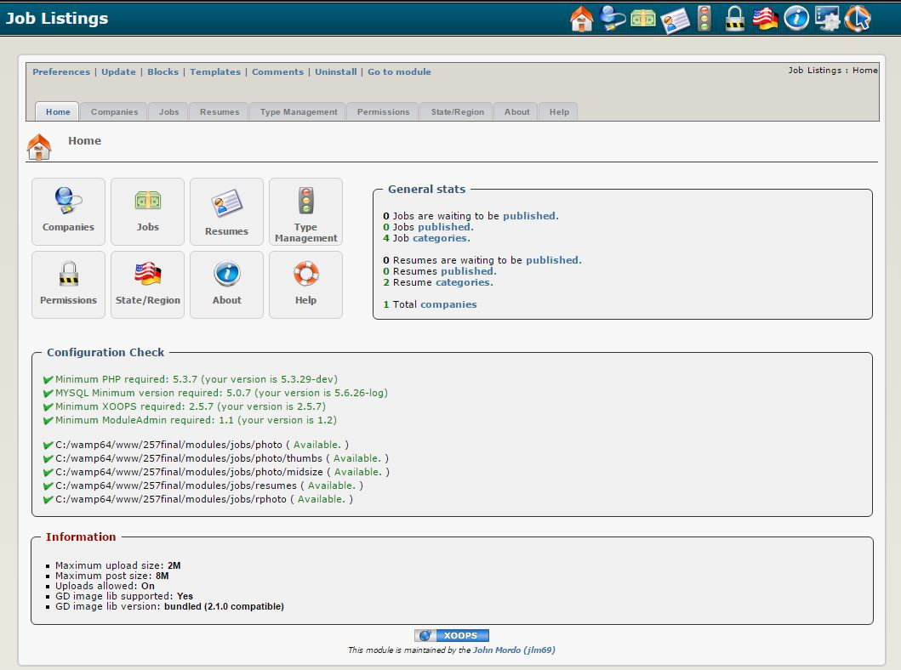

### _XOOPS Documentation Series_

# Module Jobs
#### for XOOPS 2.5.7
      

            
## User Manual

© 2018 XOOPS Project ([www.xoops.org](http://xoops.org))    

## Module Purpose 

This module is for posting Jobs announcements on your Website.

## Key Features 
1. Notifications
2. Group Permissions
3. Premium users can set how long their listing will last
4. Users can view all listings for a company, and if that user is the submitter, they can administer their listings from there. they will also be shown how many replies they have had for each listing and have a link to show them the replies
5. Users can sort the Job Listings by job title, date, company, popularity. Users can sort the Resume Listings by job title, date, experience, popularity
6. Users can now create their resume if they don't have one to upload. For now it is just a one field form using a WYSIWYG editor. In the future it will get more involved, hopefully
7. Users can add their resume as .doc or .pdf, they can also create one from scratch if they don't have one.(Uses a WYSIWYG editor) Resumes can be set to private, using a password or key that the submitter creates when adding their resume, no one can view the resume without the key, if the submitter adds a key. If no key is added the listing will be public

*Figure 1: Main view of the Jobs Module (Admin side)*

## Download/Fork the Module  

**You can fork the module --> [here](https://github.com/XoopsModules25x/jobs))** 

## How to Contribute

[You can contribute on GitHub](https://github.com/XoopsDocs/jobs-tutorial). Changes will be [pushed to Gitbook.io automatically](https://www.gitbook.com/book/xoops/jobs-tutorial/activity) when the [main repository](https://github.com/XoopsDocs/jobs-tutorial) changes.

Editing the book can be done either by updating the markdown files with a text editor, or opening the repository in [the Gitbook desktop app](https://github.com/GitbookIO/editor/blob/master/README.md). The desktop app will give you a live preview option.

# Table of Content

* [Install/Uninstall](en/book/1install.md)
* [Administration Menu](en/book/2administration.md)
* [Preferences](en/book/3preferences.md)
* [Operating Instructions](en/book/4operations.md)
* [The User Side](en/book/5userside.md)
* [Blocks](en/book/6blocks.md)
* [Templates](en/book/7templates.md)
* [Miscellaneous](en/book/8other.md) 
* [Module Credits](en/book/9credits.md)
* [About XOOPS CMS](en/book/10aboutxoops.md)

## License:

 Unless specified, this content is licensed under a <a rel="license" href="http://creativecommons.org/licenses/by-nc-sa/4.0/">Creative Commons Attribution-NonCommercial-ShareAlike 4.0 International License</a>.

All derivative works are to be attributed to XOOPS Project ([www.xoops.org](http://xoops.org))
